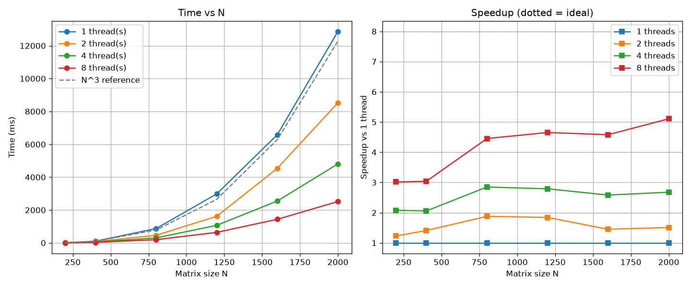

# Lab2 — Параллельное умножение матриц (OpenMP)

Лабораторная работа №2: параллельное умножение квадратных матриц на C++ с
использованием технологии OpenMP.

Цель — распараллелить алгоритм умножения матриц из лабораторной работы №1,
провести серию экспериментов с разным числом потоков и разными размерами
матриц, оценить ускорение и эффективность параллелизации, а также
верифицировать результат независимой реализацией на NumPy.

## Структура

| Файл | Назначение |
|---|---|
| `CMakeLists.txt` | Сборка C++ проекта, подключение OpenMP |
| `matrix.cpp` | Точка входа: меню, чтение, умножение, замеры, запись |
| `Matrix.cppm` | Модуль класса `Matrix` (квадратная, row-major) |
| `gen.py` | Генератор случайных матриц заданного размера |
| `bench.py` | Прогон по размерам и по числу потоков, сбор `benchmark.csv` |
| `verify.py` | Независимая проверка через NumPy |
| `plot_perf.py` | Построение графиков: время vs N и ускорение vs N |
| `requirements.txt` | Python-зависимости (numpy, matplotlib) |
| `matrix_a.txt`, `matrix_b.txt` | Примеры входных матриц |
| `result.txt` | Результат умножения (создаётся при запуске) |
| `benchmark.csv` | Таблица замеров (создаётся `bench.py`) |
| `performance.png` | Графики (создаётся `plot_perf.py`) |

## Алгоритм и распараллеливание

**Умножение (`Matrix::multiply`)** — тот же порядок циклов `i, k, j`, что и в
лабораторной №1: cache-friendly для строчного хранения, внутренний цикл идёт
по непрерывной памяти `b(k, j)` и `result(i, j)`. Умножение реализовано
вручную циклами, без сторонних матричных библиотек — именно это позволяет
корректно распараллелить его средствами OpenMP.

**Распараллеливание** — одна директива на внешнем цикле по `i`:

```cpp
Matrix Matrix::multiply(const Matrix& a, const Matrix& b) {
    const std::size_t n = a.size();
    Matrix c(n);
    const std::ptrdiff_t n_signed = static_cast<std::ptrdiff_t>(n);
#pragma omp parallel for
    for (std::ptrdiff_t i = 0; i < n_signed; ++i)
        for (std::size_t k = 0; k < n; ++k) {
            const double aik = a(i, k);
            for (std::size_t j = 0; j < n; ++j)
                c(i, j) += aik * b(k, j);
        }
    return c;
}
```

Итерации внешнего цикла независимы, строки результата `c(i, *)` не пересекаются
между потоками, поэтому гонок нет и синхронизация не требуется. Тип индекса —
знаковый `std::ptrdiff_t`, поскольку OpenMP-директива `parallel for` в MSVC
требует знаковый тип переменной цикла.

**Важно:** в `CMakeLists.txt` тип сборки по умолчанию выставлен в `Release`.
Иначе компилятор использует `-O0`/`/Od` и абсолютные времена завышаются
в разы, что делает сравнение с теоретической кривой O(N³) неинформативным.

## Сборка

```
cmake -S . -B build
cmake --build build --config Release
```

## Запуск

**1. Установить Python-зависимости (один раз):**

```
py -m pip install -r requirements.txt
```

**2. Сгенерировать матрицы:**

```
py gen.py 500
```

Аргумент — размер N; если не указан, используется 200.

**3. Запустить C++ программу:**

```
.\build\Release\matrix.exe
```

В меню выбрать `2` (умножить). Программа напечатает размер задачи, число
операций, объём памяти, число потоков OpenMP, время умножения, а затем
автоматически запустит `verify.py` и напечатает `RESULT: OK`.

**4. Полный эксперимент и графики:**

```
py bench.py
py plot_perf.py
```

`bench.py` перебирает все комбинации «размер × число потоков»
(N ∈ {200, 400, 800, 1200, 1600, 2000}, threads ∈ {1, 2, 4, 8}), для каждой
комбинации выставляет `OMP_NUM_THREADS`, запускает `matrix.exe`, парсит время
из его вывода и сохраняет всё в `benchmark.csv`. Верификация выполняется
один раз на размер (результат от числа потоков не зависит).
`plot_perf.py` строит по этому CSV два графика в `performance.png`.

## Что выводит C++ программа

```
=== Lab: square matrix multiplication ===
1. Generate matrices (python gen.py)
2. Multiply matrices (matrix_a.txt * matrix_b.txt -> result.txt)
3. Show first 5x5 elements of the result
4. Verify result (python verify.py)
5. Exit
Choice:
```

После пункта `2`:

```
Task size: 2000 x 2000 (4000000 elements)
Operations: 1.6e+10
Memory (3 matrices): 91.5527 MB
OpenMP threads: 8
Multiplication time: 2519.62 ms
Result written to result.txt
```

Затем автоматически запускается `verify.py` и печатает `RESULT: OK`.

## Проверка корректности

`verify.py` выполняет независимую проверку:

1. Читает `matrix_a.txt`, `matrix_b.txt`, `result.txt`.
2. Считает эталон через NumPy: `a @ b`.
3. Сравнивает с результатом C++ через `np.allclose` (`rtol = atol = 1e-9`).
4. Печатает максимальное абсолютное расхождение и `RESULT: OK / FAILED`.

Во всех 24 прогонах (6 размеров × 4 конфигурации потоков) расхождение
нулевое: `max |C_cpp − C_numpy| = 0.000e+00`, `RESULT: OK`.

## Исходные данные для графиков

### Таблица 1 — Время умножения, мс

| N    | 1 поток   | 2 потока  | 4 потока  | 8 потоков |
|------|-----------|-----------|-----------|-----------|
| 200  | 12.274    | 9.998     | 5.901     | 4.071     |
| 400  | 106.623   | 75.676    | 51.845    | 35.083    |
| 800  | 874.035   | 465.362   | 306.789   | 196.257   |
| 1200 | 2983.110  | 1619.960  | 1069.230  | 641.056   |
| 1600 | 6585.000  | 4540.440  | 2550.490  | 1437.440  |
| 2000 | 12868.800 | 8527.150  | 4806.780  | 2519.620  |

### Таблица 2 — Ускорение относительно 1 потока (S = T₁ / T_p)

| N    | 1 поток | 2 потока | 4 потока | 8 потоков |
|------|---------|----------|----------|-----------|
| 200  | 1.00×   | 1.23×    | 2.08×    | 3.01×     |
| 400  | 1.00×   | 1.41×    | 2.06×    | 3.04×     |
| 800  | 1.00×   | 1.88×    | 2.85×    | 4.45×     |
| 1200 | 1.00×   | 1.84×    | 2.79×    | 4.65×     |
| 1600 | 1.00×   | 1.45×    | 2.58×    | 4.58×     |
| 2000 | 1.00×   | 1.51×    | 2.68×    | 5.11×     |

### Таблица 3 — Эффективность параллелизации (E = S / p)

| N    | 2 потока | 4 потока | 8 потоков |
|------|----------|----------|-----------|
| 200  | 0.61     | 0.52     | 0.38      |
| 400  | 0.70     | 0.51     | 0.38      |
| 800  | 0.94     | 0.71     | 0.56      |
| 1200 | 0.92     | 0.70     | 0.58      |
| 1600 | 0.73     | 0.65     | 0.57      |
| 2000 | 0.75     | 0.67     | 0.64      |

### Таблица 4 — Сравнение с Lab1 (Debug, 1 поток)

Ускорение Lab1 → Lab2 (1 поток) — это чистый эффект флагов оптимизации,
без вклада OpenMP.

| N    | Lab1 Debug (мс) | Lab2 Release, 1 поток (мс) | Ускорение от `-O2` |
|------|-----------------|---------------------------|--------------------|
| 200  | 70.438          | 12.274                    | 5.74×              |
| 400  | 584.192         | 106.623                   | 5.48×              |
| 800  | 4501.770        | 874.035                   | 5.15×              |
| 1200 | 15969.800       | 2983.110                  | 5.35×              |
| 1600 | 37745.100       | 6585.000                  | 5.73×              |
| 2000 | 70992.600       | 12868.800                 | **5.52×**          |

### Верификация (все 24 прогона)

| N    | max diff (любое число потоков) | RESULT |
|------|-------------------------------|--------|
| 200  | 0.000e+00                     | OK     |
| 400  | 0.000e+00                     | OK     |
| 800  | 0.000e+00                     | OK     |
| 1200 | 0.000e+00                     | OK     |
| 1600 | 0.000e+00                     | OK     |
| 2000 | 0.000e+00                     | OK     |

## Графики



**Левый график** — время умножения vs N для каждого числа потоков.
Пунктирная серая линия — теоретическая зависимость O(N³), масштабированная по
первой точке кривой 1 потока. Все четыре кривые идут практически параллельно
ей, то есть кубическая сложность сохраняется при любом числе потоков.

**Правый график** — ускорение относительно 1 потока как функция N. Точками
отмечены измеренные значения, пунктирные горизонтальные линии — идеальное
ускорение (равное числу потоков). Видно, что:
- на малых N (200, 400) кривые далеки от идеала — сказываются накладные
  расходы на запуск/синхронизацию OpenMP-региона, сопоставимые с временем
  самого умножения;
- с ростом N кривые поднимаются и на N = 2000 достигают ≈ 5.1× на 8 потоках;
- на 8 потоках плато на уровне ≈ 5×, то есть выше добавочные потоки
  ускорения не дают.

## Выводы

1. Результаты умножения полностью совпадают с эталоном NumPy при любом
   числе потоков (все 24 комбинации — `max diff = 0`, `RESULT: OK`).
   Параллелизация не меняет результат.

2. Время растёт примерно как N³ при любом числе потоков: при увеличении N
   в 10 раз (200 → 2000) время растёт примерно в 1000 раз, что соответствует
   теоретической оценке. Кривые на левом графике идут параллельно
   теоретической O(N³).

3. Ускорение растёт с увеличением N и числа потоков: на N = 2000 оно
   достигает ≈ 5.1× на 8 потоках. Дальше рост упирается в пропускную
   способность памяти — наивный алгоритм i-k-j на каждую операцию
   обращается к DRAM, и когда полосы уже не хватает, добавление потоков
   не помогает.

4. Эффективность параллелизации на больших N составляет 0.56–0.64 на
   8 потоках — для memory-bound задачи это нормально. На малых N (200)
   она падает до 0.38, потому что время умножения становится сопоставимо
   с накладными расходами на запуск параллельной секции.

5. Отдельно стоит отметить эффект от флагов оптимизации. Сборка в `Release`
   оказалась примерно в 5.5 раза быстрее старого `Debug`-варианта из Lab1:
   N = 2000 в один поток — 12 869 мс против 70 993 мс. То есть один только
   переход на `-O2` даёт выигрыш больший, чем распараллеливание на 8 потоков,
   и об этом важно помнить при оценке подобных задач.

6. Верификация полностью автоматизирована: `bench.py` для каждой
   комбинации «размер × потоки» сам вызывает `matrix.exe` с нужным
   `OMP_NUM_THREADS`, парсит время и один раз на размер запускает
   `verify.py`. Итог сохраняется в `benchmark.csv` и печатается
   Markdown-таблицей, а `plot_perf.py` строит графики по этому же CSV.
